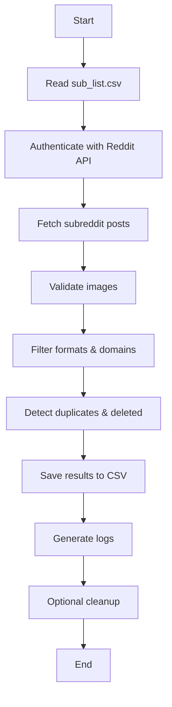

# Reddit Image Scraper

A robust, asynchronous Python tool for scraping and validating image URLs from Reddit subreddits, featuring comprehensive error handling, resource monitoring, and efficient batch processing.

## Quick Start

```bash
# 1. Install dependencies
pip install -r requirements.txt

# 2. Create sub_list.csv with subreddit names
Pixiv
Art
DigitalPainting

# 3. Run the script
python main.py
```

On first run, enter your Reddit credentials. Config will be saved in `reddit_config.json`.

### Example `sub_list.csv`

```
Pixiv
Art
DigitalPainting
ImaginaryLandscapes
AnimeSketch
```

### Example Output (`new_img.csv`)

```
subreddit,url,width,height,size_bytes
Pixiv,https://i.redd.it/example1.jpg,1200,1600,245678
Art,https://preview.redd.it/example2.png,800,600,134567
DigitalPainting,https://i.redd.it/example3.jpeg,1920,1080,456789
```

### Example Command-Line Interaction

```
Select an operation:
1. Scrape New Images
2. Clean Existing CSVs
3. Combined (Scrape + Clean)
4. Clean Specific Subreddit
Enter choice [1-4]: 1
```

### Workflow Diagram



---

## Project Background

This project started as a small experiment to explore the Reddit API and practice working with CSV data. The initial version was a simple script for fetching and saving image links. Over time, with the help from vibe coding, I restructured it into a more organized, object-oriented application. As someone without a formal computer science background, this project provided hands-on experience in asynchronous programming, API integration, and structuring Python code for scalability and maintainability.

## Features

Core Features:

- Asynchronous processing for optimal performance
- Robust error handling with custom exception hierarchy
- Resource monitoring and adaptive batch processing
- Comprehensive configuration validation
- Progress visualization with detailed statistics

Image Processing:

- Advanced duplicate detection using perceptual hashing
- Format validation (JPG, PNG, JPEG)
- Size and dimension checks
- Domain-based filtering
- Deleted image detection

Data Management:

- Excel-compatible CSV output (UTF-8-sig)
- Efficient batch processing with configurable sizes
- Automatic retry mechanisms for failed requests
- Detailed logging with error categorization

Security:

- Secure credential storage with encryption
- Configuration validation using JSONSchema
- Rate limiting and request throttling
- Resource usage monitoring and optimization

## Requirements

Core Dependencies:

- **asyncpraw** – Reddit API wrapper
- **aiohttp** – Async HTTP requests
- **opencv-python** – Image processing
- **numpy** – Image data arrays
- **tqdm** – Progress bars
- **aiofiles** – Async file operations

Additional Dependencies:

- **jsonschema** – Configuration validation
- **psutil** – System resource monitoring
- **imagehash** – Image comparison and duplicate detection
- **pytest** – Testing framework (development only)
- **pytest-asyncio** – Async test support (development only)

## Usage

- **Scrape New Images** – Collect, validate, filter, save results
- **Clean Existing CSVs** – Validate and remove invalid/duplicate links
- **Combined** – Scrape + clean in sequence
- **Clean Specific Subreddit** – Clean one subreddit’s CSV

### Output

- `{subreddit}_img_list.csv` – Subreddit results
- `new_img.csv` – Latest run
- `reddit_config.json` – Config and credentials
- `{subreddit}_errors.log` – Failed validations
- `reddit_scraper.log` – General logs

## Project Structure

```
project/
├── main.py                  # Main script
├── sub_list.csv             # Subreddits list
├── reddit_config.json       # Config file
├── requirements.txt         # Project dependencies
├── tests/                   # Test suite
│   ├── conftest.py         # Test configuration
│   ├── test_scraper.py     # Core functionality tests
│   └── test_data/          # Test fixtures
├── reddit_scraper/          # Core package
│   ├── base.py             # Base classes and utilities
│   ├── auth.py             # Authentication
│   ├── config.py           # Config management
│   ├── data_manager.py     # Data operations
│   ├── image_processor.py  # Image validation
│   ├── cleaner.py         # CSV cleaning
│   ├── exceptions.py      # Custom exceptions
│   └── scraper.py        # Scraping logic
└── .gitignore             # Prevents exposing credentials
```

## Configuration

All settings are validated using JSONSchema:

Performance Settings:

- `batch_size`: Parallel image checks (default 10, auto-adjusted based on system resources)
- `rate_limit_delay`: Delay between requests (default 1s, adaptive based on Reddit's response)
- `max_memory_percent`: Maximum memory usage before batch size adjustment (default 75%)
- `max_cpu_percent`: Maximum CPU usage threshold (default 80%)

Reddit Settings:

- `post_limit`: Posts per subreddit (default 100)
- `retry_attempts`: Failed request retries (default 3)
- `request_timeout`: Timeout for requests (default 30s)

Image Processing:

- `supported_formats`: Allowed formats [jpg, png, jpeg]
- `excluded_domains`: Blocked domains (e.g., ["i.imgur.com"])
- `min_image_size`: Minimum file size (10KB)
- `min_dimensions`: Minimum width/height (100x100)
- `hash_size`: Perceptual hash size for duplicate detection (default 8)
- `hash_threshold`: Similarity threshold for duplicates (default 0.9)

## Security

- Credentials stored locally in `reddit_config.json`
- Protected with `.gitignore`
- Never share your config file

## Excel Integration

- CSVs use UTF-8-sig encoding
- One URL per row, easy to filter and import into Excel

## Troubleshooting

Common Issues:

- **API Errors**:
  - Check credentials in `reddit_config.json`
  - Verify internet connection
  - Check Reddit API status
- **Rate Limits**:
  - System automatically adjusts `rate_limit_delay`
  - Monitor `reddit_scraper.log` for rate limit warnings
  - Consider reducing `batch_size` if persistent
- **Performance Issues**:
  - System automatically adjusts batch size based on resources
  - Check `max_memory_percent` and `max_cpu_percent` settings
  - Monitor resource usage in logs
- **Image Errors**:
  - Deleted or inaccessible images are auto-retried
  - Check error logs for specific failure reasons
  - Verify image domain is not blocked

For detailed error information, check:

- `reddit_scraper.log`: General operation logs
- `{subreddit}_errors.log`: Subreddit-specific errors
- Exception messages include detailed context and suggestions

## Testing

The project includes a comprehensive test suite using pytest:

```bash
# Run all tests
pytest

# Run with coverage report
pytest --cov=reddit_scraper

# Run specific test categories
pytest tests/test_scraper.py -k "test_config"
```

Test Categories:

- Configuration validation
- Reddit API integration
- Image processing and validation
- Error handling and recovery
- Resource monitoring
- Batch processing optimization

Test fixtures and mock data are provided in `tests/test_data/`.

## Contributing

Feel free to submit issues, fork the repository, and create pull requests for any improvements.

Before contributing:

1. Run the test suite to ensure all tests pass
2. Add tests for any new functionality
3. Follow the existing code style and documentation patterns
4. Update documentation as needed

## License

This project is licensed under the MIT License - see the LICENSE file for details.
